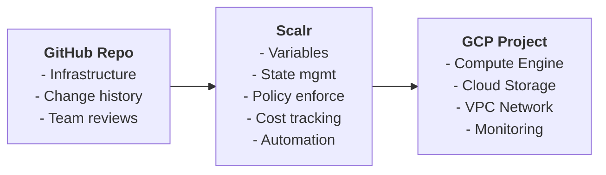

# MSP Demo Client Infrastructure

*Godspoon | dev@spoon.rip*

This is a simple demo of how an MSP could define/manage client infrastructure using **OpenTofu**, **GitHub**, and **Scalr** on Google Cloud Platform. This setup leverages GCP's generous Always Free tier, so your demo environments can run at zero cost.

## Why This Matters

### For MSPs:
- **Version Control Everything**: No more "who changed what when" nightmares
- **Uniformity & Simplicity**: Entire organizations or packages can be defined, deployed & maintained from a few files
- **Scale Efficiently**: Manage multiple clients consistently
- **Cost Control**: Predictable scaling/billing

### For Clients:
- **Transparency**: Complete visibility into infrastructure changes
- **Reliability**: Consistent, tested deployment patterns
- **Growth Ready**: Infrastructure that can scale with their business
- **Documentation**: Everything is tracked and documented

## Architecture Overview



## What Gets Built

This infrastructure creates a complete web application environment:

**Resources:**
- VPC network with private subnet (10.0.1.0/24)
- Firewall rules (HTTP/HTTPS public, SSH restricted to MSP IPs)
- Static external IP address
- Ubuntu compute instance with Apache web server & simple web page
- Service account with logging/monitoring permissions
- Storage bucket with lifecycle policy and versioning
- Log sink capturing application/system logs to storage bucket
- IAM bindings for GCP service account permissions
- Sample files (branded web page, README in GCP bucket viewable on Scalr)

## Project Structure

```
demo-client-infrastructure/
├── main.tf                     # Core infrastructure resources
├── variables.tf                # Configuration options
├── outputs.tf                  # Important values and commands
├── terraform.tf                # Provider configuration
├── environments/               # Environment-specific settings
│   ├── dev/terraform.tfvars   # Free tier configuration
│   ├── staging/terraform.tfvars  # In theory
│   └── prod/terraform.tfvars  # In theory
└── README.md                   # This file lol
```

## Getting Started

### Prerequisites

**Install Google Cloud CLI (Arch Linux):**
```bash
# Install from AUR
yay -S google-cloud-cli

# Alternative: Install from official package
curl -O https://dl.google.com/dl/cloudsdk/channels/rapid/downloads/google-cloud-cli-linux-x86_64.tar.gz
tar -xf google-cloud-cli-linux-x86_64.tar.gz
./google-cloud-sdk/install.sh
```

**Initialize and Login:**
```bash
# Initialize gcloud
gcloud init

# Login to your Google account
gcloud auth login

# Set default project (replace with your project ID)
gcloud config set project YOUR_PROJECT_ID

# Enable application default credentials for Terraform
gcloud auth application-default login
```

### GCP Project Setup

**Enable Required APIs:**
```bash
gcloud services enable compute.googleapis.com
gcloud services enable storage.googleapis.com
gcloud services enable logging.googleapis.com
```

**Create Service Account for Scalr:**
```bash
gcloud iam service-accounts create scalr-terraform \
    --display-name="Scalr Terraform Service Account"
```

**Grant Necessary Permissions:**
```bash
# Replace PROJECT_ID with your actual project ID
gcloud projects add-iam-policy-binding PROJECT_ID \
    --member="serviceAccount:scalr-terraform@PROJECT_ID.iam.gserviceaccount.com" \
    --role="roles/compute.admin"

gcloud projects add-iam-policy-binding PROJECT_ID \
    --member="serviceAccount:scalr-terraform@PROJECT_ID.iam.gserviceaccount.com" \
    --role="roles/storage.admin"

gcloud projects add-iam-policy-binding PROJECT_ID \
    --member="serviceAccount:scalr-terraform@PROJECT_ID.iam.gserviceaccount.com" \
    --role="roles/logging.admin"
```

**Create Service Account Key:**
```bash
gcloud iam service-accounts keys create scalr-key.json \
    --iam-account=scalr-terraform@PROJECT_ID.iam.gserviceaccount.com
```

### Repository Setup

1. **Clone this repository**
2. **Update `environments/dev/terraform.tfvars`** with your project ID
3. **Configure Scalr workspace** with the service account key
4. **Set sensitive variables** in Scalr:
   - `ssh_public_key`: Your SSH public key
   - `msp_ip_range`: Your office IP range (for SSH access)
5. **Push changes** and watch Scalr deploy your infrastructure

## Environment Configuration

### Development (Free Tier)
- **Machine Type**: f1-micro (free)
- **Disk**: 10GB persistent disk
- **Storage**: 5GB Cloud Storage
- **Cost**: $0/month

## Security Considerations

- **Network Isolation**: VPC with custom subnets
- **Firewall Rules**: Minimal required access (HTTP, SSH from your IP)
- **Service Accounts**: Least privilege access
- **Secret Management**: Sensitive data stored in Scalr, not Git
- **Audit Trail**: Complete change history in Git and Scalr

## Free Tier Limits

**Always Free Resources:**
- 1 f1-micro Compute Engine instance (US regions only)
- 30GB persistent disk storage
- 5GB Cloud Storage (regional)
- 1GB network egress per month
- Static IP (when attached to running instance)

**Supported Regions for Free Tier:**
- us-central1 (Iowa)
- us-east1 (South Carolina)  
- us-west1 (Oregon)
The same Terraform code works across all environments - just different variable values and project targets.

## Common/Easy Operations After Deployment

**SSH to instance:**
```bash
ssh ubuntu@INSTANCE_IP
```

**Upload files to storage:**
```bash
gsutil cp myfile.txt gs://BUCKET_NAME/
```

**View logs:**
```bash
gcloud logging read 'resource.type="gce_instance"' --limit=10
```

**Check costs:**
```bash
gcloud billing budgets list
```
